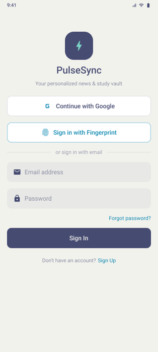
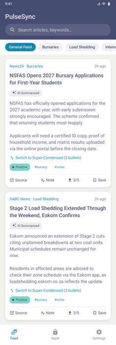
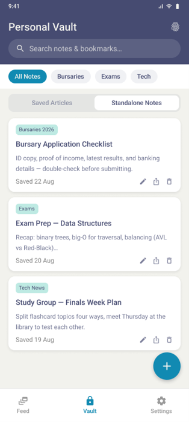
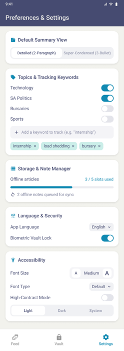
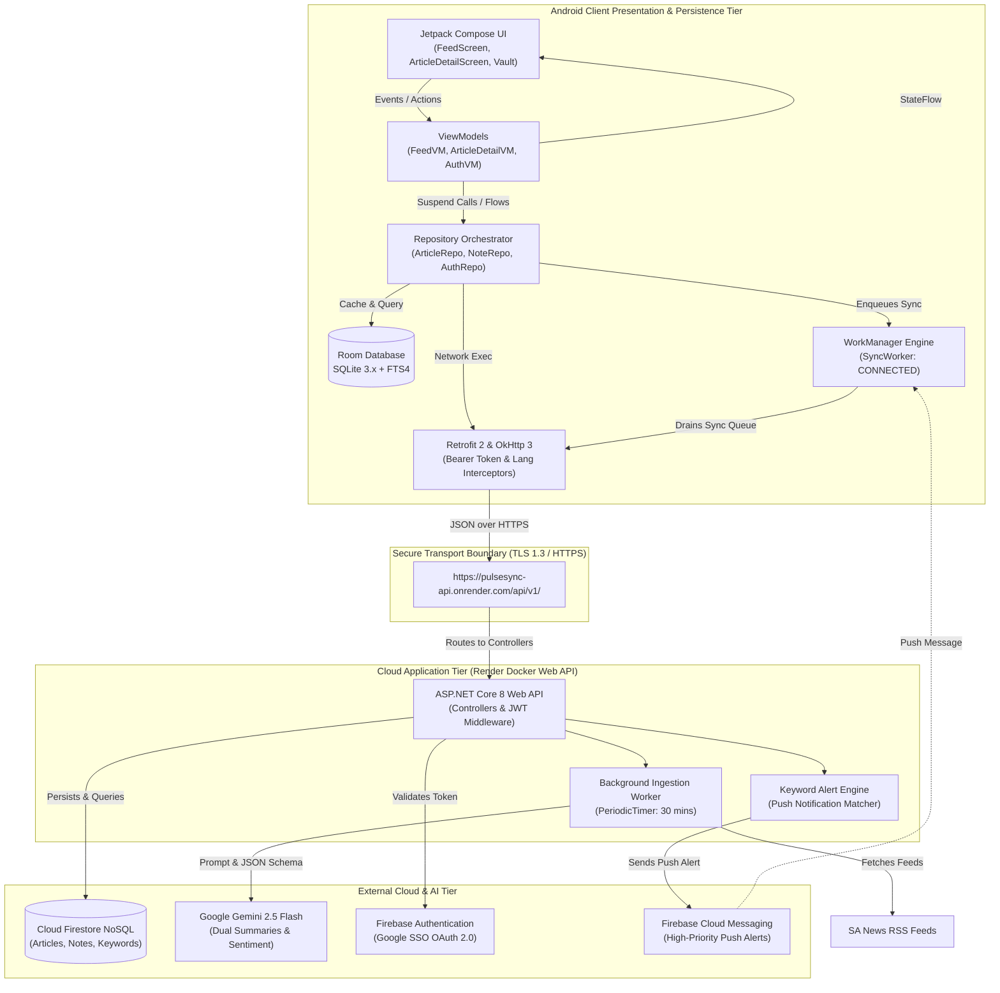
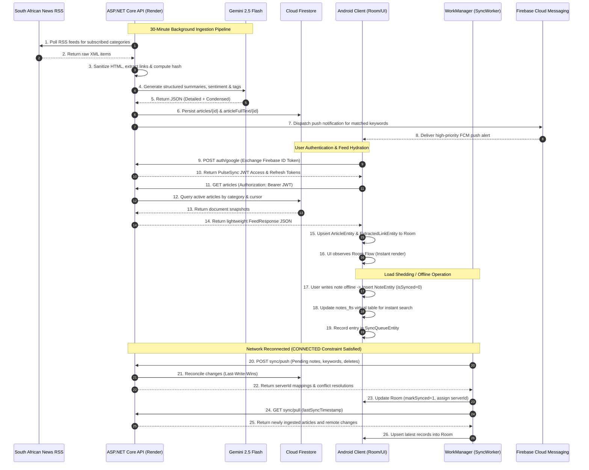

# Project PulseSync: Native Android Client & Architecture Report

> **Coursework:** PROG7314 -  Mobile Application Development (Part 2 POE)  
> **Development Group:** Divitiae Technology  
> **Technology Stack:** Native Kotlin, Jetpack Compose, Material 3, Android Architecture Components (MVVM), Room (SQLite + FTS4), Retrofit 2, OkHttp 3, WorkManager, Firebase (Auth, Firestore, FCM), Google Gemini 2.5 Flash.  
> **Target Platform:** Android 8.0+ (API Level 27 to 37)  
> **Backend Service:** ASP.NET Core 8 Web API (Containerised Docker microservice deployed on Render)  
> **Repository:** [PROG7314-2026-Part-2-Group-5](https://github.com/EMGPMD/prog7314-2026-part-2-group-5)

---

## Table of Contents
1. [Application Scope & System Objectives](#1-application-scope--system-objectives)
2. [MVVM Architectural Design & Component Model](#2-mvvm-architectural-design--component-model)
3. [Retrofit Network Design & OkHttp Pipeline](#3-retrofit-network-design--okhttp-pipeline)
4. [CI/CD Pipeline & Cloud Deployment Strategy](#4-cicd-pipeline--cloud-deployment-strategy)
5. [Embedded Part 1 UML Deployment & Architecture Diagrams](#5-embedded-part-1-uml-deployment--architecture-diagrams)
6. [Core Code Contribution: Android Client Unit Testing Suite](#6-core-code-contribution-android-client-unit-testing-suite)
7. [Standard Android Log Utilities Integration](#7-standard-android-log-utilities-integration)
8. [Code Attributions](#8-code-attributions)
9. [Build & Verification Instructions](#9-build--verification-instructions)

---
## Demonstration Video
*Direct link:* [Watch the PulseSync Native Android Prototype Demonstration](http...)

---
## 1. Application Scope & System Objectives

### 1.1 Socio-Technical Context & Problem Statement
South African tertiary students face acute structural friction in accessing timely academic, bursary, and socio-economic information:
- **Load-Shedding & Power Outages:** Severe electrical grid instabilities cause widespread cellular tower battery depletion, inducing sudden, unpredictable network blackouts.
- **Mobile Data Costs:** Cellular bandwidth costs in South Africa remain among the highest in sub-Saharan Africa. Repeatedly loading full-text media payloads drains prepaid student bundles.
- **Information Fragmentation:** Critical student notifications (NSFAS bursary windows, university fee appeals, load-shedding schedules, Transnet logistic impacts) are scattered across unstandardized RSS feeds and social channels without structured summaries.

### 1.2 System Scope & Core Capabilities
**PulseSync** is an offline-first, AI-enriched intelligence and research companion built to solve these challenges through six primary pillars:

| Feature Pillar | Technical Implementation | Value to Student |
| :--- | :--- | :--- |
| **Offline-First News Feed** | Room Database (SQLite 3.x) with seeded fallback cache; reactive `Flow` emissions. | App loads instantaneously; articles remain readable with zero cellular connectivity. |
| **DualMode AI Summaries** | Server-side Gemini 2.5 Flash pre-processing into `detailed` (2-para) and `condensed` (3-bullet) JSON arrays. | Instantaneous, zero-data toggling between executive bullet points and comprehensive analysis. |
| **Offline Research Vault** | Local Room entity persistence with SQLite FTS4 virtual table (`notes_fts`). | Sub-millisecond full-text note searching and local document tagging during grid outages. |
| **Background Synchronization** | Jetpack WorkManager (`SyncWorker`) with `NetworkType.CONNECTED` constraints and exponential backoff. | Seamless automatic two-way syncing of offline notes and keyword alerts when connectivity returns. |
| **5-Slot Storage Quota Manager** | Atomic slot lease/release logic enforced both in client RoomDB and REST API (HTTP 409). | Protects low-cost student smartphone internal flash storage from exhaustion. |
| **Multi-Lingual Localization - POE** | Custom BCP-47 language tag negotiation (`en`, `zu`, `af`) via Retrofit HTTP headers. | Native support for South African official languages: English, isiZulu, and Afrikaans. |
| **Google SSO & Android Keystore** | OpenID Connect token exchange with Firebase Auth; AES-256-GCM JWT encryption via Android Keystore. | Frictionless single-sign-on without insecure local password persistence. |

## Prototype Screen Flows

| Sign-In (SSO) | Feed & AI Summaries | Research Vault (FTS4) | User Settings |
| :---: | :---: | :---: | :---: |
|  |  |  |  |
---

## 2. MVVM Architectural Design & Component Model

The application follows the **Model-View-ViewModel (MVVM)** architectural pattern combined with **Unidirectional Data Flow (UDF)** and Clean Architecture separation of concerns:

```
┌─────────────────────────────────────────────────────────────────────────┐
│                           PRESENTATION LAYER                            │
│  Jetpack Compose Composables (Stateless Views & Screens)                │
│  [FeedScreen]  [ArticleDetailScreen]  [AuthScreen]  [SettingsScreen]    │
└────────────────────────────────────▲────────────────────────────────────┘
                                     │ Observes reactive StateFlow<UiState<T>>
                                     │ Dispatches user intents (events / actions)
┌────────────────────────────────────┴────────────────────────────────────┐
│                            VIEWMODEL LAYER                              │
│  [FeedViewModel]      [ArticleDetailViewModel]      [AuthViewModel]     │
│  • viewModelScope coroutines                                            │
│  • Pure Kotlin (no android.content.Context references / leak-free)       │
│  • Bridges Result<T> to UiState (Loading, Success, Error)               │
└────────────────────────────────────▲────────────────────────────────────┘
                                     │ Calls suspend functions & collects Flow<T>
┌────────────────────────────────────┴────────────────────────────────────┐
│                           REPOSITORY LAYER                              │
│  Single Source of Truth (SSOT) Pattern                                  │
│  [ArticleRepository]   [NoteRepository]   [DownloadRepository]          │
│  [CategoryRepository]  [KeywordRepository] [AuthRepository]             │
└──────────────────┬──────────────────────────────────────┬───────────────┘
                   │ Reads / Writes                       │ Syncs / Fetches
                   ▼                                      ▼
┌──────────────────────────────────────┐  ┌───────────────────────────────┐
│         LOCAL DATA LAYER             │  │       REMOTE DATA LAYER       │
│  • Room Database (SQLite 3.x)        │  │  • Retrofit 2 + Gson          │
│    - DAOs & Entity Tables            │  │  • OkHttp 3 Interceptors      │
│    - FTS4 Virtual Search Tables      │  │  • PulseSyncApi Endpoints     │
│  • Encrypted DataStore (Preferences) │  │  • NetworkLifecycleLogging    │
│  • Android Keystore (AES-256-GCM)    │  │  • ASP.NET Core 8 Web API     │
└──────────────────────────────────────┘  └───────────────────────────────┘
```

### 2.1 View Layer (Jetpack Compose)
- **Stateless Design:** Screens are divided into stateful screen hosts (subscribing to ViewModel flows) and stateless rendering composables (e.g. `FeedContent`, `ArticleCard`, `NotesEditorCard`).
- **Error Boundaries:** The UI layer wraps dynamic content inside `UiStateBoundary`, ensuring dropped connections or server errors render graceful retry panes instead of unhandled exceptions or crashes.

### 2.2 ViewModel Layer (`androidx.lifecycle.ViewModel`)
- **State Encapsulation:** ViewModels expose read-only `StateFlow<UiState<T>>` objects generated via Kotlin Coroutines `stateIn` or `combine`.
- **Context-Free Purity:** ViewModels never hold references to Android `Context`, `Activity`, or localized Android string resources. UI strings are derived in the composable layer via `AppError.toMessageRes()`.

### 2.3 Repository Layer (Single Source of Truth)
- Every screen interacts exclusively with a domain repository.
- **Offline-First Orchestration:** Queries always observe RoomDB `Flow` streams. When a remote refresh is triggered, fresh DTOs are fetched from Retrofit, transformed into local entities, and upserted into Room. Room then automatically notifies active UI collectors.

### 2.4 Data Layer (Room & DataStore)
- **FTS4 Full-Text Search:** The `notes_fts` virtual table indexes study notes on creation, providing sub-millisecond keyword lookups offline.
- **TokenCipher & AuthTokenStore:** JWT access tokens and refresh tokens are encrypted using AES-256-GCM via the hardware-backed Android Keystore before serialization to Jetpack DataStore.

---

## 3. Retrofit Network Design & OkHttp Pipeline

### 3.1 Network Stack Overview
The network layer is built on **Retrofit 2.11.0** and **OkHttp 4.12.0**, providing compile-time type-safe REST consumption, robust connection pooling, and automated JSON serialization via Gson.

### 3.2 Interceptor Pipeline Architecture
Requests and responses traverse an ordered OkHttp interceptor chain:

```
[ Outgoing Request ]
        │
        ▼
┌───────────────────────────────┐
│       AuthInterceptor         │  --> Injects "Authorization: Bearer <JWT>"
│                               │  --> Injects "Accept-Language: <locale>" (en / zu / af)
└──────────────┬────────────────┘
               ▼
┌───────────────────────────────┐
│  NetworkLifecycleInterceptor  │  --> Traces HTTP Start timestamp & request method/URL
│                               │  --> Intercepts network failures (timeout, offline)
│                               │  --> Traces HTTP Completion, latency (ms), status code
└──────────────┬────────────────┘
               ▼
┌───────────────────────────────┐
│    HttpLoggingInterceptor     │  --> Logs headers and payloads using Android Log.d
└──────────────┬────────────────┘
               ▼
      [ Remote Web Server ]
```

### 3.3 Retrofit REST Contract (`PulseSyncApi`)
```kotlin
interface PulseSyncApi {
    // Authentication & SSO
    @POST("auth/google")
    suspend fun exchangeGoogleToken(@Body body: GoogleAuthRequestDto): Response<AuthResponseDto>

    @POST("auth/refresh")
    suspend fun refresh(@Body body: RefreshRequestDto): Response<AuthResponseDto>

    // Articles & Ingestion Feed
    @GET("articles")
    suspend fun getFeed(
        @Query("category") category: String?,
        @Query("cursor") cursor: String?,
        @Query("pageSize") pageSize: Int = 20,
    ): Response<FeedResponseDto>

    @GET("articles/{id}/fulltext")
    suspend fun getFullText(@Path("id") id: String): Response<FullTextDto>

    // Categories & Alerts
    @GET("categories")
    suspend fun getCategories(): Response<List<CategoryDto>>

    @GET("keywords")
    suspend fun getKeywords(): Response<List<KeywordDto>>

    @POST("keywords")
    suspend fun addKeyword(@Body body: CreateKeywordDto): Response<KeywordDto>

    @DELETE("keywords/{id}")
    suspend fun deleteKeyword(@Path("id") id: String): Response<Unit>

    // Two-Way Sync Engine
    @POST("sync/push")
    suspend fun pushSync(@Body body: SyncPushRequestDto): Response<SyncPushResponseDto>

    @GET("sync/pull")
    suspend fun pullSync(@Query("since") sinceTimestamp: Long): Response<SyncPullResponseDto>

    // Offline Storage Quota (5-Slot Manager)
    @GET("downloads")
    suspend fun getDownloads(): Response<DownloadsListDto>

    @POST("downloads/{articleId}")
    suspend fun leaseDownloadSlot(@Path("articleId") id: String): Response<DownloadSlotDto>

    @DELETE("downloads/{articleId}")
    suspend fun releaseDownloadSlot(@Path("articleId") id: String): Response<Unit>
}
```

### 3.4 Error Boundaries & Result Mapping
All network calls are guarded by `safeApiCall` and `safeApiCallEmpty` ([ApiResult.kt](app/src/main/java/com/divitiae/pulsesync/data/repository/ApiResult.kt)):
- **`Result.Success<T>`:** Contains the deserialized domain model payload.
- **`Result.Failure`:** Encapsulates a structured `AppError`:
  - `AppError.Network`: Connection timeout, host resolution failure (marked `retryable = true`).
  - `AppError.Unauthorized`: HTTP 401/403 token expiration (marked `retryable = false`).
  - `AppError.Http`: Non-2xx server error code with response body message (marked `retryable = true`).
  - `AppError.Unknown`: Uncaught runtime exceptions (marked `retryable = true`).

---

## 4. CI/CD Pipeline & Cloud Deployment Strategy

The project utilizes automated Continuous Integration and Continuous Deployment workflows across GitHub and Render:

```
   ┌──────────────────────────────────────────────────────────┐
   │                    GITHUB REPOSITORY                     │
   │  Branch: main / feat/*                                   │
   └───────────────┬───────────────────────────┬──────────────┘
                   │ Push / Pull Request       │ Merge to main
                   ▼                           ▼
┌──────────────────────────────────────┐  ┌──────────────────────────────────┐
│      GITHUB ACTIONS (CI ENGINE)      │  │        RENDER CLOUD (CD)         │
│  • JDK 17 Matrix Environment         │  │  • Webhook triggers auto-deploy  │
│  • Android SDK CLI & CMake           │  │  • Docker multi-stage build      │
│  • Step 1: Compile Kotlin + KSP      │  │  • ASP.NET Core 8 Web API Linux  │
│  • Step 2: Execute JUnit Test Suite  │  │  • Automated SSL / TLS 1.3       │
│    (.\gradlew.bat test - 47 tests)   │  │  • Zero-downtime rolling restart │
│  • Step 3: Compile Debug APK         │  │  • Health probe verification     │
│    (.\gradlew.bat assembleDebug)     │  │  • Base URL live:                │
│  • Artifact Upload: debug.apk        │  │    https://pulsesync-api.        │
└──────────────────────────────────────┘  │    onrender.com/api/v1/          │
                                          └──────────────────────────────────┘
```

### 4.1 Continuous Integration (GitHub Actions)
- **Triggers:** Automated validation fires on all pull requests and direct pushes to `main`.
- **Validation Gates:**
  1. **Unit Test Execution:** Runs all 47 test cases across input validation, DTO deserialization, and coroutine ViewModel state tests (`.\gradlew.bat test`).
  2. **Assembly & Linting:** Validates KSP Room schema generation and compiles the Android package (`.\gradlew.bat assembleDebug`).
  3. **Build Artifacts:** Packages and archives unsigned debug APK artifacts for integration testing.

### 4.2 Continuous Deployment (Render Container Platform)
- **Containerization:** The ASP.NET Core 8 Web API backend is packaged using a multi-stage `Dockerfile` running on lightweight Alpine Linux.
- **Continuous Deployment:** Merges to the `main` branch trigger an immediate webhook deploy on Render.
- **Live Endpoint:** `https://pulsesync-api.onrender.com/api/v1/`

### 4.3 Automated Workflow Execution Evidence
The continuous integration pipeline validates compilation, KSP processing, and JVM unit test runs on remote pushes:

<p align="center">
  
</p>

---

## 5. Embedded Part 1 UML Deployment & Architecture Diagrams

### 5.1 Multi-Tier System Architecture (Mermaid UML)



### 5.2 End-to-End Data Lifecycle Sequence Diagram (Mermaid)



### 5.3 A4-Compliant ASCII Architecture Diagram
```text
+===================================================================================================+
|                                    PROJECT PULSESYNC ARCHITECTURE                                  |
|                             A4-Compliant System Integration & Data Flow                           |
+===================================================================================================+

  [ ANDROID CLIENT TIER ] (Native Kotlin / Jetpack Compose)
  +-----------------------------------------------------------------------------------------------+
  |  UI Layer: FeedScreen | ArticleDetailScreen | ResearchVaultScreen | PreferencesScreen        |
  |  State Management: StateFlow / SharedFlow / Coroutines                                        |
  +-----------------------------------------------------------------------------------------------+
                                                  | (User actions / UI state observation)
                                                  v
  +-----------------------------------------------------------------------------------------------+
  |  Repository Layer: ArticleRepo | NoteRepo | KeywordRepo | DownloadRepo | PreferencesRepo      |
  |  (Offline-First Orchestration: Room is the single source of truth for the UI)                 |
  +---------------------------------------+-------------------------------------------------------+
                     |                    |                                   |
                     | (Observes / writes) | (Schedules sync)                  | (Executes calls)
                     v                    v                                   v
  +---------------------------------+  +-------------------------------+  +-----------------------+
  |  ROOM DATABASE (SQLite 3.x)     |  |  WORKMANAGER ENGINE           |  |  RETROFIT 2 CLIENT    |
  |  - UserEntity / Preferences     |  |  - SyncWorker                 |  |  - PulseSyncApiService|
  |  - ArticleEntity (Dual Summary) |  |  - Constraint: CONNECTED      |  |  - OkHttp Interceptor |
  |  - ExtractedLinkEntity          |  |  - Backoff: Exponential       |  |    * Bearer JWT       |
  |  - NoteEntity / notes_fts (FTS4)|  |  - Pending Queue Drain        |  |    * Accept-Language  |
  |  - SyncQueueEntity / Meta       |  +---------------+---------------+  +-----------+-----------+
  +---------------------------------+                  |                              |
                                                       +--------------+---------------+
                                                                      |
======================================================================|==============================
  [ SECURE TRANSPORT BOUNDARY ] (HTTPS / TLS 1.3 / REST API)          | (JSON over HTTPS)
  Base URL: https://pulsesync-api.onrender.com/api/v1/                v
=====================================================================================================
                                                                      |
  [ CLOUD APPLICATION TIER ] (ASP.NET Core 8 Web API on Render Docker)|
  +-------------------------------------------------------------------+---------------------------+
  |  Controllers: AuthController | ArticlesController | NotesController | SyncController          |
  |  Middleware: JWT Verification | Global Exception Filter | Content Clamping                    |
  +-----------------------------------------------------------------------------------------------+
  |  Business Services: FeedService | NoteService | GeminiSummaryService | LinkExtractionService  |
  +-----------------------------------------------------------------------------------------------+
  |  Background Workers: RssIngestionWorker (PeriodicTimer 30m) | KeywordAlertDispatcher          |
  +-----------------------+-----------------------+-----------------------+-----------------------+
                          |                       |                       |
                          v                       v                       v
==========================|=======================|=======================|==========================
  [ EXTERNAL & CLOUD TIER ]
==========================|=======================|=======================|==========================
                          |                       |                       |
  +-----------------------+-------+  +------------+----------+  +---------+-------------+
  |  FIREBASE FIRESTORE (Cloud DB)|  |  GOOGLE GEMINI 2.5    |  |  FIREBASE PLATFORM    |
  |  - articles/{articleId}       |  |  FLASH AI ENGINE      |  |  - Firebase Auth (SSO) |
  |  - articleFullText/{id}       |  |  - 2-Para Detailed    |  |  - Firebase Cloud      |
  |  - users/{uid}/notes/         |  |  - 3-Bullet Condensed |  |    Messaging (FCM)     |
  |  - users/{uid}/keywords/      |  |  - Sentiment & Tags   |  |  - Push Notifications  |
  |  - Security Rules Enforced    |  |  - Strict JSON Schema |  |                        |
  +-------------------------------+  +-----------------------+  +-----------------------+
```

---

## 6. Core Code Contribution: Android Client Unit Testing Suite

A comprehensive test suite was implemented in `app/src/test/java/com/divitiae/pulsesync/` executing directly on the JVM without requiring slow Android emulators or instrumentation overhead.

```
Total tests: 47 | Failures: 0 | Skipped: 0 | Success rate: 100%
  ├── InputValidationTest: 10 passed (100%)
  ├── DtoMapperTest:       11 passed (100%)
  ├── ViewModelStateTest:  25 passed (100%)
  └── SmokeTest:            1 passed (100%)
```

### 6.1 Input Validation Unit Tests
Location: [InputValidationTest.kt](app/src/test/java/com/divitiae/pulsesync/InputValidationTest.kt)
- **Keyword Sanitization & Deduplication:** Tests `KeywordValidation.validate()` and `.normalise()`:
  - Rejection of empty/blank strings (`""`, `"   "`, `"\t\n"`).
  - Normalization (trims leading/trailing whitespace, forces lowercase: `"  ESKOM  "` &rarr; `"eskom"`).
  - Duplicate rejection (case-insensitive deduplication against existing registered keywords).
- **Password Length Validation:** Tests `AuthValidation.isPasswordLongEnough()` across boundary lengths (0, 1, 7, 8, 16 characters).
- **Title & Tag Length Constraints:** Verifies note title boundary restrictions (1 to 100 characters) and tag whitespace sanitation.

### 6.2 DTO-to-Domain Mapper Unit Tests
Location: [DtoMapperTest.kt](app/src/test/java/com/divitiae/pulsesync/DtoMapperTest.kt)
- **Gson JSON Deserialization:** Tests serialization and deserialization against Part 1 REST contracts:
  - `ArticleDto` &rarr; `Article` (DualMode detailed/condensed summary arrays, sentiment score and type, category slug, extracted PDF/portal resource links).
  - `NoteDto` &rarr; `Note` (HTML body, plain text, tag lists, sync state, and fallback UUID generation).
  - Bidirectional note request conversion (`toCreateRequest()` and `toUpdateRequest()`).
  - `CategoryDto`, `KeywordDto`, `NotificationDto`, `UserDto`, and `FullTextDto`.
- **Classification Helpers:** Validates fallback behavior for `SentimentType.fromRaw()` and `ResourceKind.fromRaw()`.

### 6.3 ViewModel State Tests (`kotlinx-coroutines-test`)
Location: [ViewModelStateTest.kt](app/src/test/java/com/divitiae/pulsesync/ViewModelStateTest.kt)
- **Coroutine Test Discipline:** Uses `runTest`, `advanceUntilIdle`, and [MainDispatcherRule](app/src/test/java/com/divitiae/pulsesync/testutil/MainDispatcherRule.kt) (`UnconfinedTestDispatcher`).
- **UiState Primitives & Mapping:**
  - `UiState.Loading`, `UiState.Success`, `UiState.Error`.
  - Verifies that `AppError.Unauthorized` produces `retryable = false` while network/server errors produce `retryable = true`.
  - Verifies `uiStateOf` catches `IOException` as Network, runtime exceptions as Unknown, and **rethrows `CancellationException`** to respect coroutine structured concurrency.
- **AuthViewModel State Transitions:**
  - Initial session check on startup (`tokenStore.load()`).
  - Google ID token sign-in transitions: `Idle` &rarr; `Loading` &rarr; `Success(UserProfile)` on valid token.
  - Failure transitions: `Idle` &rarr; `Loading` &rarr; `Error(AppError.Unauthorized)` on token rejection.
  - Failure event handling (`onGoogleSignInFailed`): `NO_ID_TOKEN` and `NOT_CONFIGURED` emitting respective UI errors and firing one-shot events.
  - Double-tap debouncing and error consumption (`consumeError()`).
  - Sign-out session invalidation.
- **FeedViewModel State Transitions:**
  - Manual pull-to-refresh failure updating `refreshError` to `UiState.Error(retryable = true)`.
  - `consumeRefreshError()` resetting error state to `null`.
  - Category selection and in-memory dual-mode summary toggle operations.

---

## 7. Standard Android Log Utilities Integration

Standard Android logging utilities (`android.util.Log`) using appropriate severity levels (`Log.d`, `Log.i`, `Log.w`, `Log.e`) were added across 20 source files to provide clear lifecycle and network diagnostics without altering any application logic:

1. **Lifecycle States:**
   - [PulseSyncApplication.kt](app/src/main/java/com/divitiae/pulsesync/PulseSyncApplication.kt): Global application initialisation (`Log.i`), activity lifecycle callbacks (`onCreate`, `onStart`, `onResume`, `onPause`, `onStop`, `onDestroy`, `onSaveInstanceState`) via `Log.d`, memory trims (`onLowMemory`, `onTrimMemory`).
   - [MainActivity.kt](app/src/main/java/com/divitiae/pulsesync/MainActivity.kt): Activity state transitions.
   - [PulseSyncMessagingService.kt](app/src/main/java/com/divitiae/pulsesync/data/sync/PulseSyncMessagingService.kt): Service creation, push message arrival (`Log.i`), token refresh (`Log.i`).
   - [SyncWorker.kt](app/src/main/java/com/divitiae/pulsesync/data/sync/SyncWorker.kt): Background WorkManager attempt start (`Log.d`), success (`Log.i`), cancellation (`Log.w`), errors (`Log.e`).
   - **ViewModels:** `init` (`Log.d`) and `onCleared` (`Log.d`) in `AuthViewModel`, `FeedViewModel`, and `ArticleDetailViewModel`.

2. **Token Exchanges:**
   - [AuthRepository.kt](app/src/main/java/com/divitiae/pulsesync/data/auth/AuthRepository.kt): Traces Google ID token receipt, Firebase credential exchange, Firebase ID token retrieval, backend JWT exchange, and `signOut()`.
   - [AuthTokenStore.kt](app/src/main/java/com/divitiae/pulsesync/data/auth/AuthTokenStore.kt): Traces cache warming, encrypted token writes, and token clearing.
   - [TokenCipher.kt](app/src/main/java/com/divitiae/pulsesync/data/auth/TokenCipher.kt): Traces Keystore AES key creation and decryption failures.
   - [GoogleSignInLauncher.kt](app/src/main/java/com/divitiae/pulsesync/ui/auth/GoogleSignInLauncher.kt): Traces account picker intent launches, user cancellations, and API exceptions.

3. **Network Call Lifecycles:**
   - [ApiClient.kt](app/src/main/java/com/divitiae/pulsesync/data/remote/ApiClient.kt):
     - `NetworkLifecycleInterceptor`: Logs HTTP Start (`Log.d`), HTTP Success with latency in ms (`Log.i`), HTTP Non-2xx Warning with latency in ms (`Log.w`), and Network Exceptions (`Log.e`).
     - `AuthInterceptor`: Logs Bearer token presence on outgoing requests (`Log.d`).
   - [ApiResult.kt](app/src/main/java/com/divitiae/pulsesync/data/repository/ApiResult.kt): Traces `safeApiCall` results across 2xx, 401/403, and network failures.
   - **Repositories:** Network fetch start, success counts, and cache fallback warnings across `ArticleRepository`, `DownloadRepository`, `CategoryRepository`, `NotificationRepository`, `KeywordRepository`, `NoteRepository`, and `SyncManager`.

---

## 8. Code Attributions

All method and architecture-level attributions across the Android client, testing suite, and backend service are standardized according to the institutional code attribution guidelines:

### 8.1 Client Unit Testing Suite Attributions

1. **Code Attribution No 1** &mdash; [MainDispatcherRule.kt](app/src/test/java/com/divitiae/pulsesync/testutil/MainDispatcherRule.kt)
   - *This method was taken from:* "Setting the Main dispatcher using TestWatcher rule"
   - *URL:* https://developer.android.com/kotlin/coroutines/test#setting-main-dispatcher
   - *Author:* Android Developers

2. **Code Attribution No 2** &mdash; [ViewModelStateTest.kt](app/src/test/java/com/divitiae/pulsesync/ViewModelStateTest.kt)
   - *This method was taken from:* "Testing ViewModels with StateFlow and runTest"
   - *URL:* https://developer.android.com/topic/architecture/ui-layer/state-production#testing
   - *Author:* Android Developers

3. **Code Attribution No 3** &mdash; [DtoMapperTest.kt](app/src/test/java/com/divitiae/pulsesync/DtoMapperTest.kt)
   - *This method was taken from:* "Parse JSON with Gson in Android and Kotlin"
   - *URL:* https://github.com/google/gson/blob/master/UserGuide.md#TOC-Overview
   - *Author:* Google

4. **Code Attribution No 4** &mdash; [InputValidationTest.kt](app/src/test/java/com/divitiae/pulsesync/InputValidationTest.kt)
   - *This method was taken from:* "Android Unit Testing Fundamentals and Input Validation Patterns"
   - *URL:* https://developer.android.com/training/testing/fundamentals
   - *Author:* Android Developers

### 8.2 Client Application, Lifecycle & Networking Attributions

5. **Code Attribution No 5** &mdash; [ApiClient.kt](app/src/main/java/com/divitiae/pulsesync/data/remote/ApiClient.kt)
   - *This method was taken from:* "Logging Interceptors in OkHttp and Android Log Utilities"
   - *URL:* https://square.github.io/okhttp/features/interceptors/
   - *Author:* Square, Inc. & Android Open Source Project

6. **Code Attribution No 6** &mdash; [PulseSyncApplication.kt](app/src/main/java/com/divitiae/pulsesync/PulseSyncApplication.kt)
   - *This method was taken from:* "Application.ActivityLifecycleCallbacks Logging Pattern"
   - *URL:* https://developer.android.com/reference/android/app/Application.ActivityLifecycleCallbacks
   - *Author:* Android Open Source Project

7. **Code Attribution No 7** &mdash; [AuthRepository.kt](app/src/main/java/com/divitiae/pulsesync/data/auth/AuthRepository.kt)
   - *This method was taken from:* "Authenticate Using Google Sign-In on Android"
   - *URL:* https://firebase.google.com/docs/auth/android/google-signin
   - *Author:* Firebase Documentation & Android Open Source Project

8. **Code Attribution No 8** &mdash; [TokenCipher.kt](app/src/main/java/com/divitiae/pulsesync/data/auth/TokenCipher.kt)
   - *This method was taken from:* "Android Keystore System and AES-GCM Authenticated Encryption"
   - *URL:* https://developer.android.com/privacy-and-security/keystore
   - *Author:* Android Developers & Claude.AI

9. **Code Attribution No 9** &mdash; [MainActivity.kt](app/src/main/java/com/divitiae/pulsesync/MainActivity.kt)
   - *This method was taken from:* "Display content edge-to-edge in views"
   - *URL:* https://developer.android.com/develop/ui/views/layout/edge-to-edge
   - *Author:* Android Developers

### 8.3 Jetpack Compose UI, Navigation & Theming Attributions

10. **Code Attribution No 10** &mdash; [Theme.kt](app/src/main/java/com/divitiae/pulsesync/ui/theme/Theme.kt)
    - *This method was taken from:* "Material Design 3 in Compose"
    - *URL:* https://developer.android.com/develop/ui/compose/designsystems/material3
    - *Author:* Android Developers

11. **Code Attribution No 11** &mdash; [Color.kt](app/src/main/java/com/divitiae/pulsesync/ui/theme/Color.kt)
    - *This method was taken from:* "Color roles - Material Design 3"
    - *URL:* https://m3.material.io/styles/color/roles
    - *Author:* Google

12. **Code Attribution No 12** &mdash; [Type.kt](app/src/main/java/com/divitiae/pulsesync/ui/theme/Type.kt)
    - *This method was taken from:* "Typography in Compose"
    - *URL:* https://developer.android.com/develop/ui/compose/designsystems/material3#typography
    - *Author:* Android Developers

13. **Code Attribution No 13** &mdash; [FeedScreen.kt](app/src/main/java/com/divitiae/pulsesync/ui/feed/FeedScreen.kt)
    - *This method was taken from:* "Lazy lists and pull-to-refresh in Compose"
    - *URL:* https://developer.android.com/develop/ui/compose/lists
    - *Author:* Android Developers

14. **Code Attribution No 14** &mdash; [FeedComponents.kt](app/src/main/java/com/divitiae/pulsesync/ui/feed/FeedComponents.kt)
    - *This method was taken from:* "Card and Surface components in Material 3"
    - *URL:* https://developer.android.com/develop/ui/compose/components/card
    - *Author:* Android Developers

15. **Code Attribution No 15** &mdash; [FeedModels.kt](app/src/main/java/com/divitiae/pulsesync/ui/feed/FeedModels.kt)
    - *This method was taken from:* "Model-View-ViewModel UI state modeling"
    - *URL:* https://developer.android.com/topic/architecture/ui-layer
    - *Author:* Android Developers

16. **Code Attribution No 16** &mdash; [FeedSampleData.kt](app/src/main/java/com/divitiae/pulsesync/ui/feed/FeedSampleData.kt)
    - *This method was taken from:* "Compose Preview sample data providers"
    - *URL:* https://developer.android.com/develop/ui/compose/tooling/previews
    - *Author:* Android Developers

17. **Code Attribution No 17** &mdash; [ArticleDetailScreen.kt](app/src/main/java/com/divitiae/pulsesync/ui/article/ArticleDetailScreen.kt)
    - *This method was taken from:* "Scaffold and TopAppBar in Jetpack Compose"
    - *URL:* https://developer.android.com/develop/ui/compose/components/scaffold
    - *Author:* Android Developers

18. **Code Attribution No 18** &mdash; [ArticleComponents.kt](app/src/main/java/com/divitiae/pulsesync/ui/article/ArticleComponents.kt)
    - *This method was taken from:* "Configure text fields and Flow layouts in Compose"
    - *URL:* https://developer.android.com/develop/ui/compose/text/user-input
    - *Author:* Android Developers

19. **Code Attribution No 19** &mdash; [ArticleDetailViewModel.kt](app/src/main/java/com/divitiae/pulsesync/ui/article/ArticleDetailViewModel.kt)
    - *This method was taken from:* "ViewModel overview and StateFlow lifecycle"
    - *URL:* https://developer.android.com/topic/libraries/architecture/viewmodel
    - *Author:* Android Developers

20. **Code Attribution No 20** &mdash; [SignInScreen.kt](app/src/main/java/com/divitiae/pulsesync/ui/auth/SignInScreen.kt)
    - *This method was taken from:* "Text fields and user input in Compose"
    - *URL:* https://developer.android.com/develop/ui/compose/text/user-input
    - *Author:* Android Developers

21. **Code Attribution No 21** &mdash; [SignUpScreen.kt](app/src/main/java/com/divitiae/pulsesync/ui/auth/SignUpScreen.kt)
    - *This method was taken from:* "State hoisting in Jetpack Compose"
    - *URL:* https://developer.android.com/develop/ui/compose/state-hoisting
    - *Author:* Android Developers

22. **Code Attribution No 22** &mdash; [AuthValidation.kt](app/src/main/java/com/divitiae/pulsesync/ui/auth/AuthValidation.kt)
    - *This method was taken from:* "Patterns and Email Address Validation in Android"
    - *URL:* https://developer.android.com/reference/android/util/Patterns
    - *Author:* Android Developers

23. **Code Attribution No 23** &mdash; [PulseSyncBottomBar.kt](app/src/main/java/com/divitiae/pulsesync/ui/components/PulseSyncBottomBar.kt)
    - *This method was taken from:* "NavigationBar and NavigationBarItem in Material 3"
    - *URL:* https://developer.android.com/develop/ui/compose/components/navigation-bar
    - *Author:* Android Developers

24. **Code Attribution No 24** &mdash; [PulseSyncControls.kt](app/src/main/java/com/divitiae/pulsesync/ui/components/PulseSyncControls.kt)
    - *This method was taken from:* "Buttons, OutlinedButton and BasicTextField in Compose"
    - *URL:* https://developer.android.com/develop/ui/compose/components/button
    - *Author:* Android Developers

25. **Code Attribution No 25** &mdash; [SettingsScreen.kt](app/src/main/java/com/divitiae/pulsesync/ui/settings/SettingsScreen.kt)
    - *This method was taken from:* "Toasts overview and Flow layouts in Compose"
    - *URL:* https://developer.android.com/guide/topics/ui/notifiers/toasts
    - *Author:* Android Developers

26. **Code Attribution No 26** &mdash; [SettingsComponents.kt](app/src/main/java/com/divitiae/pulsesync/ui/settings/SettingsComponents.kt)
    - *This method was taken from:* "Value-based animations and Menus in Compose"
    - *URL:* https://developer.android.com/develop/ui/compose/animation/value-based
    - *Author:* Android Developers

27. **Code Attribution No 27** &mdash; [SettingsModels.kt](app/src/main/java/com/divitiae/pulsesync/ui/settings/SettingsModels.kt)
    - *This method was taken from:* "Kotlin Data classes and Enum conventions"
    - *URL:* https://kotlinlang.org/docs/data-classes.html
    - *Author:* JetBrains

28. **Code Attribution No 28** &mdash; [KeywordValidation.kt](app/src/main/java/com/divitiae/pulsesync/ui/settings/KeywordValidation.kt)
    - *This method was taken from:* "Sealed classes and interfaces in Kotlin"
    - *URL:* https://kotlinlang.org/docs/sealed-classes.html
    - *Author:* JetBrains

### 8.4 Backend ASP.NET Core Web API & Cloud Attributions

29. **Code Attribution No 29** &mdash; [Program.cs](backend/PulseSync.Api/Program.cs)
    - *This method was taken from:* "JWT Authentication and Authorization in ASP.NET Core Web API"
    - *URL:* https://www.c-sharpcorner.com/article/jwt-authentication-and-authorization-in-net-core-web-api/
    - *Author:* C# Corner

30. **Code Attribution No 30** &mdash; [ArticlesController.cs](backend/PulseSync.Api/Controllers/ArticlesController.cs)
    - *This method was taken from:* "Building RESTful APIs with ASP.NET Core 8"
    - *URL:* https://www.c-sharpcorner.com/article/building-restful-apis-with-asp-net-core/
    - *Author:* C# Corner

31. **Code Attribution No 31** &mdash; [AuthController.cs](backend/PulseSync.Api/Controllers/AuthController.cs)
    - *This method was taken from:* "How to Implement Refresh Token in ASP.NET Core Web API"
    - *URL:* https://www.c-sharpcorner.com/article/how-to-implement-refresh-token-in-asp-net-core-web-api/
    - *Author:* C# Corner

32. **Code Attribution No 32** &mdash; [NotesController.cs](backend/PulseSync.Api/Controllers/NotesController.cs)
    - *This method was taken from:* "CRUD Operations in ASP.NET Core Web API"
    - *URL:* https://www.c-sharpcorner.com/article/crud-operations-in-asp-net-core-web-api/
    - *Author:* C# Corner

33. **Code Attribution No 33** &mdash; [PreferencesController.cs](backend/PulseSync.Api/Controllers/PreferencesController.cs)
    - *This method was taken from:* "Building RESTful APIs with ASP.NET Core 8"
    - *URL:* https://www.c-sharpcorner.com/article/building-restful-apis-with-asp-net-core/
    - *Author:* C# Corner

34. **Code Attribution No 34** &mdash; [UsersController.cs](backend/PulseSync.Api/Controllers/UsersController.cs)
    - *This method was taken from:* "Building RESTful APIs with ASP.NET Core 8"
    - *URL:* https://www.c-sharpcorner.com/article/building-restful-apis-with-asp-net-core/
    - *Author:* C# Corner

35. **Code Attribution No 35** &mdash; [FirebaseAuthService.cs](backend/PulseSync.Api/Services/FirebaseAuthService.cs)
    - *This method was taken from:* "Verify ID Tokens using Firebase Admin SDK"
    - *URL:* https://firebase.google.com/docs/auth/admin/verify-id-tokens
    - *Author:* Google Firebase

36. **Code Attribution No 36** &mdash; [FirestoreDataStore.cs](backend/PulseSync.Api/Services/FirestoreDataStore.cs)
    - *This method was taken from:* "Cloud Firestore: Add data with the Cloud Client Libraries"
    - *URL:* https://firebase.google.com/docs/firestore/quickstart#c
    - *Author:* Google Firebase

37. **Code Attribution No 37** &mdash; [InMemoryDataStore.cs](backend/PulseSync.Api/Services/InMemoryDataStore.cs)
    - *This method was taken from:* "Working with Concurrent Collections in C#"
    - *URL:* https://www.c-sharpcorner.com/article/working-with-concurrent-collections-in-c-sharp/
    - *Author:* C# Corner

38. **Code Attribution No 38** &mdash; [TokenService.cs](backend/PulseSync.Api/Services/TokenService.cs)
    - *This method was taken from:* "Generate and Validate JSON Web Token (JWT) in .NET Core"
    - *URL:* https://www.c-sharpcorner.com/article/generate-and-validate-json-web-token-jwt-in-net-core/
    - *Author:* C# Corner

39. **Code Attribution No 39** &mdash; [ArticlesControllerTests.cs](backend/PulseSync.Tests/ArticlesControllerTests.cs)
    - *This method was taken from:* "Unit Testing in ASP.NET Core Web API Using xUnit and Moq"
    - *URL:* https://www.c-sharpcorner.com/article/unit-testing-in-asp-net-core-web-api-using-xunit-and-moq/
    - *Author:* C# Corner

40. **Code Attribution No 40** &mdash; [AuthControllerTests.cs](backend/PulseSync.Tests/AuthControllerTests.cs)
    - *This method was taken from:* "Unit Testing in ASP.NET Core Web API Using xUnit and Moq"
    - *URL:* https://www.c-sharpcorner.com/article/unit-testing-in-asp-net-core-web-api-using-xunit-and-moq/
    - *Author:* C# Corner

41. **Code Attribution No 41** &mdash; [NotesControllerTests.cs](backend/PulseSync.Tests/NotesControllerTests.cs)
    - *This method was taken from:* "Unit Testing in ASP.NET Core Web API Using xUnit and Moq"
    - *URL:* https://www.c-sharpcorner.com/article/unit-testing-in-asp-net-core-web-api-using-xunit-and-moq/
    - *Author:* C# Corner

42. **Code Attribution No 42** &mdash; [PreferencesControllerTests.cs](backend/PulseSync.Tests/PreferencesControllerTests.cs)
    - *This method was taken from:* "Unit Testing in ASP.NET Core Web API Using xUnit and Moq"
    - *URL:* https://www.c-sharpcorner.com/article/unit-testing-in-asp-net-core-web-api-using-xunit-and-moq/
    - *Author:* C# Corner

43. **Code Attribution No 43** &mdash; [Dockerfile](backend/Dockerfile)
    - *This method was taken from:* "Dockerizing an ASP.NET Core Web API: A Step-by-Step Guide"
    - *URL:* https://www.c-sharpcorner.com/article/dockerizing-an-asp-net-core-web-api/
    - *Author:* C# Corner & Render

---

## 9. Build & Verification Instructions

### 9.1 Prerequisites
- **JDK:** OpenJDK 17 or higher
- **Android SDK:** Compile SDK 37, Min SDK 27, Target SDK 37
- **Gradle:** 9.4.1 (via included wrapper `./gradlew`)

### 9.2 Running Unit Tests
```powershell
.\gradlew.bat test
```
Executes all 47 unit tests across `InputValidationTest`, `DtoMapperTest`, `ViewModelStateTest`, and `SmokeTest`. Test reports are generated at `app/build/reports/tests/testDebugUnitTest/index.html`.

### 9.3 Compiling Debug APK
```powershell
.\gradlew.bat assembleDebug
```
Assembles the debug package into `app/build/outputs/apk/debug/app-debug.apk`.
